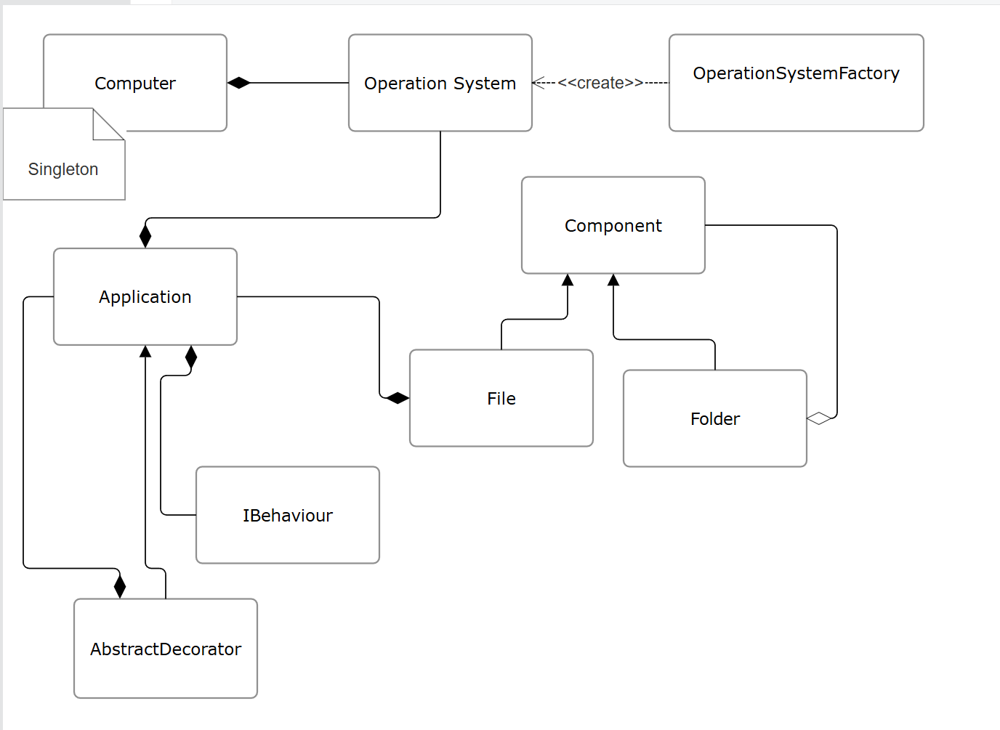

# LABORATORY WORK Nr. 2 & 3
# Behavioral and Structural Design Patterns

## Author: Musin Vladislava

----

## Objectives:

&ensp; &ensp; __1. Study and understand the Behavioral Design Patterns.__

&ensp; &ensp; __2. As a continuation of the previous laboratory work, think about what communication between software entities might be involed in your system.__

&ensp; &ensp; __3. Implement some additional functionalities using behavioral design patterns.__


## Used Design Patterns:
### Structural:
* Composite
* Decorator
* Bridge

### Behavioural
* Strategy

## Implementation
Simplified class diagram of the project


* Bridge Pattern
    Used the Bridge Pattern to create a "bridege" between Operation System and application so that a version of every app can be created for every operation system. OperationalSystem is an attribute of Application.
```
public abstract class Application {
    protected OperationalSystem operationalSystem;
    protected final IBehaviour behaviour;
//Constructor and methods

}
```
* Decorator pattern 
    Used the decorator pattern to add additional details to an app (Such as Menu Bar, Play Bar or Scroll Bar)
```
public abstract class AbstractDecorator extends Application {
     protected Application application;
     //Constructor and methods
```
* Composite Pattern
    used Composite Pattern to replicate the behaviour of a file system
    
* Strategy pattern
    Used Strategy pattern to represent the general behaviour of an aplplication (ex: view, execute, edit)
```
public abstract class Application {
    protected OperationalSystem operationalSystem;
    protected final IBehaviour behaviour;
//Constructor and methods

}
```


## Main method:
```
    public static void main(String[] args) throws Exception {
        Computer.setOS("Windows");
        Component rootDirectoryFolder = new VisibleFolder("Root");
        Computer.addComponent(rootDirectoryFolder);

        File file1 = new TextFile("file1",".txt");

        List<String> notepadextenstions = new ArrayList<>();
        notepadextenstions.add(".txt");
        notepadextenstions.add((".docx"));
        notepadextenstions.add(".sql");

        Notepad notepad = new Notepad("Windows", notepadextenstions);
        MenuBarDecorator notepadWithMenuBar = new MenuBarDecorator(notepad);
        file1.setFileViewer(notepadWithMenuBar);
        file1.open();

    }
```

## The output


## Conclusions:
Working on this project helped me understand the purpose and ways of implementing the design patterns. 